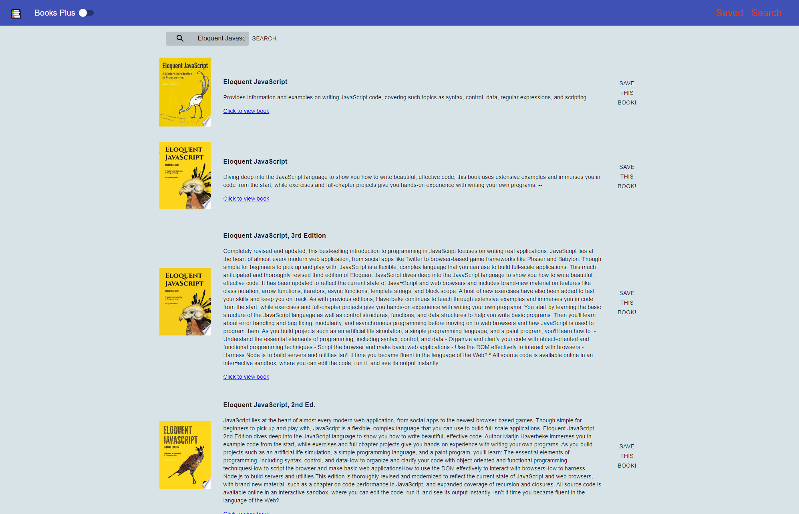

### Books Plus Saved Page

### Books Plus Search Page

# Books Plus

Search for books using Google Books. Users can search for books on the 'Search' page, and for each search result, information on the corresponding book is displayed along with the option to view the book on the Google Books website or `save` the book to view later on the 'Saved' page.

## Table of Contents

- [Installation](#installation)
- [Usage](#usage)
- [Links](#Links)
- [Technologies](#Technologies)
- [License](#License)

## Installation

1. Download or clone repository
2. `npm install` to install the required npm packages to run

## Usage

- Application will be invoked by using the following command:

  `npm start`

- Open your browser and go to

  `http://localhost:3000`

- Home page displays the search bar
- Saved page will show your saved books
- Toggle theme for an "easier on the eyes" theme

## Links

- [Github](https://github.com/jongomezdev/Books-Plus)
- [Deployed App](https://google-books-plus.herokuapp.com/)

## Technologies

- React
- React Hooks
- React Context
- Express
- MongoDb
- Mongoose
- Material UI
- JavaScript

## License

This program is free software: you can redistribute it and/or modify
it under the terms of the GNU General Public License as published by
the Free Software Foundation, either version 3 of the License, or
(at your option) any later version.
This program is distributed in the hope that it will be useful,
but WITHOUT ANY WARRANTY; without even the implied warranty of
MERCHANTABILITY or FITNESS FOR A PARTICULAR PURPOSE.See the
GNU General Public License for more details.
You should have received a copy of the GNU General Public License
along with this program. If not, see <https://www.gnu.org/licenses/>

## Contributing

Fork and feel free to create PR's on any changes made.

## Questions

Check out my other repositories in the link below:

- [GitHub Profile](https://github.com/jongomezdev)

- For any additional questions, please [email](mailto:jongomezdev@gmail.com) me.
